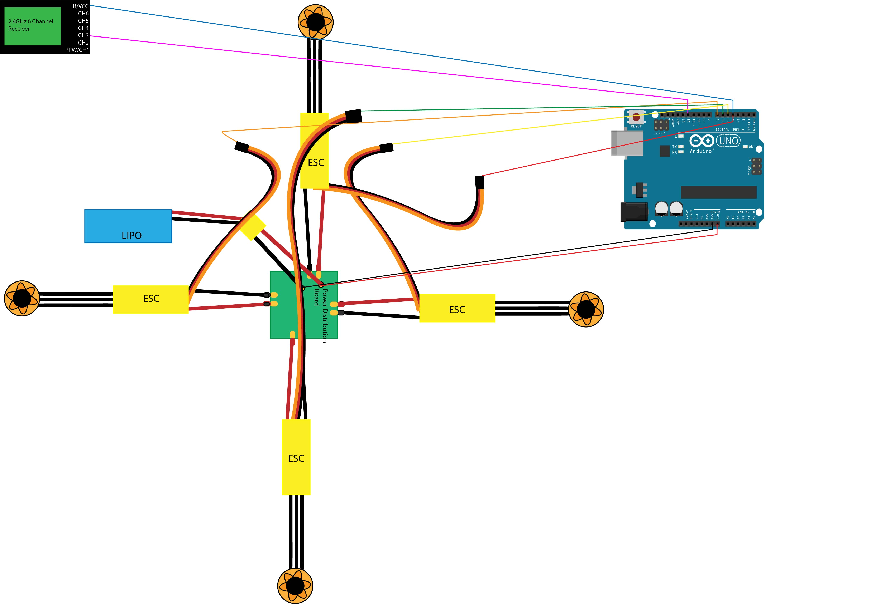

# DroneProject
Code for the Drone.
This is the README.md file 1/2/18
this is the drone repo and we would create our drone here

## Drone: Motor Calibration
Motor Calibration Schematic: [calibration.ino](calibration.ino), [calibration2.ino](calibration2.ino)

Components:
- Arduino Uno
- Breadboard
- (4) brushless motors
- (4) ESCs
- power distribution board
- lipo battery
- (9) male-to-male jumper wires

## Drone: Motors/ESCs and Receiver Connected to Arduino
Motors/ESCs + Receiver connected to Arduino on Drone schematic:

Components:
- Drone frame
- Arduino Uno
- (4) Brushless Motors
- (4) ESCs
- power distribution board
- 6 channels receiver
- lipo battery
- (4) male-to-male jumper wires

