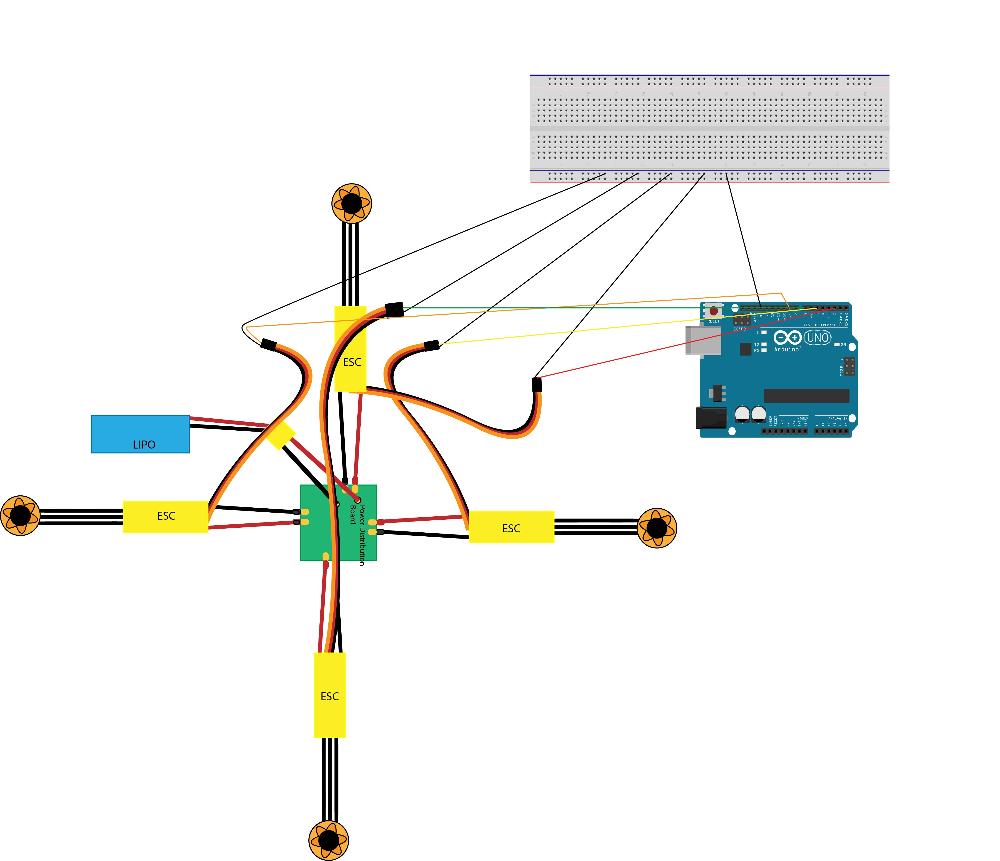

# DroneProject
Code for the Drone.
This is the README.md file 1/2/18
this is the drone repo and we would create our drone here

## Drone: Motor Calibration
Motor Calibration Schematic: , 

Components:
- Arduino Uno
- Breadboard
- (4) brushless motors
- (4) ESCs
- power distribution board
- lipo battery
- (9) male-to-male jumper wires

